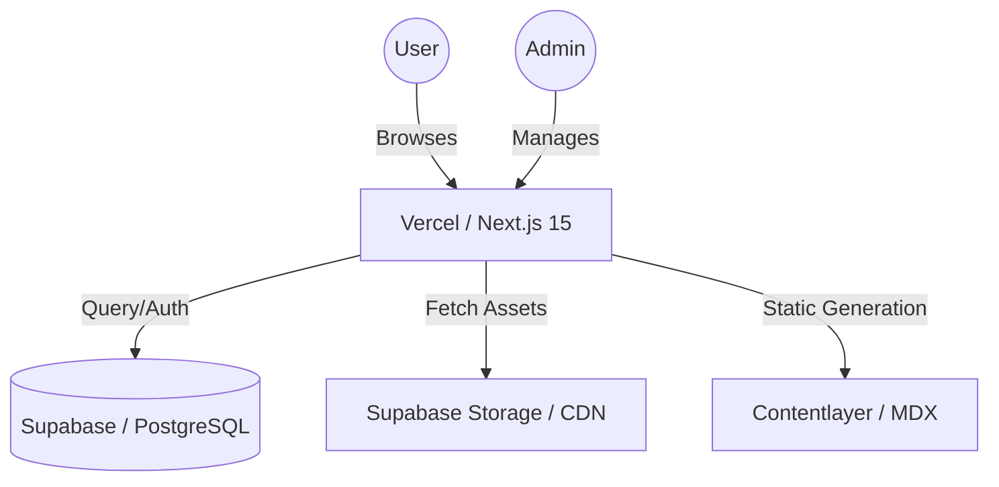
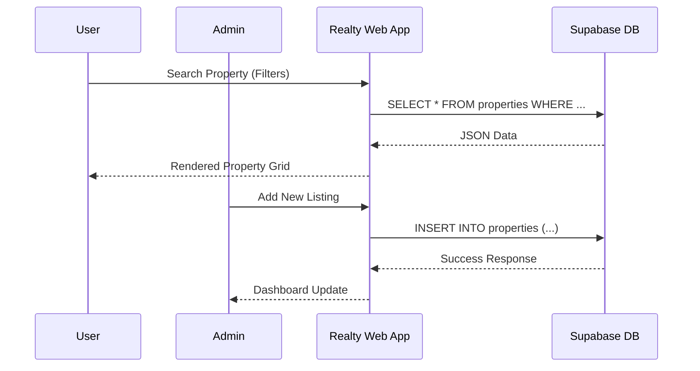
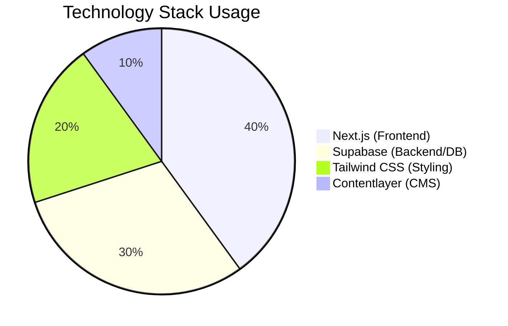

# GURU NANAK DEV UNIVERSITY, AMRITSAR
## Six Months Industrial Training Report
## ON
# Realty - REAL ESTATE DISCOVERY & INVESTMENT PLATFORM

Project submitted for partial fulfillment for the degree of
### BACHELOR OF TECHNOLOGY
In
### Computer Science & Engineering
**Batch 2016-2020**

**SUBMITTED TO:**
Dr. Sandeep Sharma
Head, DCET

**SUBMITTED BY:**
Ashutosh Singla
2016CSA1032

---

## DECLARATION

I hereby declare that the Industrial Training Report entitled ("Realty - Real Estate Discovery & Investment Platform") is an authentic record of my own work as requirements of 6-months Industrial Training during the period from January, 2026 to May, 2026 for the award of degree of B. Tech. (CSE) from Department of Computer Engineering and Technology, Guru Nanak Dev University, Amritsar under the guidance of Dr. Sandeep Sharma.

**Date:** 11 May 2026

**Ashutosh Singla**
B. Tech(CSE)
2016CSA1032

---

## ACKNOWLEDGEMENTS

It is my pleasure to be indebted to various people, who directly or indirectly contributed in the development of this project and who influenced my thinking, behavior and acts during the course of study.

I express my sincere gratitude to all for providing me an opportunity to undergo Major Project as the part of the curriculum.

I am thankful to Dr. Sandeep Sharma for his support, cooperation, and motivation provided to us during the training for constant inspiration, presence and blessings.

Lastly, I would like to thank the almighty and my parents for their moral support and friends with whom I shared our day-to day experience and received lots of suggestions that improve our quality of work.

**ASHUTOSH SINGLA**
2016CSA1032

---

## INDEX

1. INTRODUCTION TO THE PROJECT
2. MINIMUM H/W AND S/W REQUIREMENTS
3. INTRODUCTION TO TOOLS
4. FEASIBILITY STUDY
5. DATABASE DESIGN & DATA TABLES
6. SYSTEM ARCHITECTURE & DFD
7. TESTING & QUALITY ASSURANCE
8. SNAPSHOTS OF FRONT END
9. CONCLUSION & FUTURE SCOPE
10. BIBLIOGRAPHY

---

## 1. INTRODUCTION TO THE PROJECT

**Realty** is a specialized real estate discovery platform designed to streamline the process of finding and investing in residential and commercial properties in the Mohali and GMADA (Greater Mohali Area Development Authority) regions. Unlike generic real estate portals, Realty provides a curated experience with high-fidelity data, interactive maps, and regional insights tailored for local investors and homebuyers.

### 1.1 Proposed System
The Realty platform is a full-stack web application built with the **Next.js 15 App Router** and **Supabase**. It offers a seamless interface for users to:
- Browse and filter residential apartments, villas, and industrial lands.
- Access detailed regional insights and development plans (GMADA Master Plans).
- Inquire about properties through an integrated lead management system.
- Read professional real estate blogs managed via a Git-based MDX workflow.

### 1.2 Components of Realty
- **Property Search Engine:** A multi-dimensional filtering system allowing users to sort by price, location, bedrooms, and furnishing status.
- **Admin Dashboard:** A secure portal for property agents to add, update, or remove listings in real-time.
- **Interactive Maps:** Integration with Leaflet to show property locations and regional master plans.
- **Blog & Education:** An SEO-optimized content hub for market trends and investment guides.

---

## 2. MINIMUM H/W AND S/W REQUIREMENTS

### Hardware Requirements
- **Development Machine:**
  - Processor: Intel Core i5 (10th Gen) or equivalent.
  - RAM: 8GB (minimum), 16GB (recommended).
  - Storage: 256GB SSD.
- **Server:**
  - Vercel Edge Network (Global CDN).
  - Supabase PostgreSQL Instance.

### Software Requirements
- **Operating System:** Windows 10/11, macOS, or Linux.
- **Environment:** Node.js v20.x or higher.
- **Database:** PostgreSQL (via Supabase).
- **Web Browser:** Modern browsers (Chrome, Edge, Safari, Firefox).
- **Tools:** VS Code, Git, Supabase CLI.

---

## 3. INTRODUCTION TO TOOLS

### 3.1 Next.js 15 & React 19
Next.js 15 provides the foundational framework for Realty, utilizing the App Router for efficient server-side rendering (SSR) and client-side navigation. React 19 introduces improved hook management and concurrent rendering features that enhance user experience.

### 3.2 Supabase (PostgreSQL)
Supabase is used as the Backend-as-a-Service (BaaS), providing:
- **PostgreSQL Database:** Relational storage for property and lead data.
- **Row Level Security (RLS):** Ensuring data integrity and secure access control.
- **Storage:** Managed hosting for property images and documents.

### 3.3 Tailwind CSS
A utility-first CSS framework used to build a responsive and modern user interface without writing custom CSS files. It ensures consistency across all screen sizes.

### 3.4 Contentlayer & MDX
Contentlayer transforms markdown and MDX files into type-safe JSON data. This is used to manage the blog section, allowing for rich-text content with React components.

---

## 4. FEASIBILITY STUDY

### 4.1 Technical Feasibility
The stack (Next.js + Supabase) is highly feasible as it eliminates the need for managing complex server infrastructure. The use of TypeScript ensures type safety across the application, reducing runtime errors.

### 4.2 Economic Feasibility
Realty is economically viable due to the serverless nature of the chosen tools. Vercel and Supabase provide generous free tiers for development, and the pay-as-you-go model for production ensures costs scale only with usage.

### 4.3 Operational Feasibility
The system is designed with an intuitive Admin Dashboard, making it easy for non-technical users (real estate agents) to manage listings. The deployment pipeline is automated via Git, ensuring seamless updates.

---

## 5. DATABASE DESIGN & DATA TABLES

The database is structured to handle relational data efficiently.

### 5.1 Properties Table
| Column | Type | Description |
| :--- | :--- | :--- |
| id | UUID | Primary Key |
| title | TEXT | Property Name |
| slug | TEXT | URL-friendly unique identifier |
| type | TEXT | Apartment, Villa, Penthouse, etc. |
| price | NUMERIC | Listing Price |
| location | TEXT | Regional location (e.g., Mohali) |

### 5.2 Leads Table
| Column | Type | Description |
| :--- | :--- | :--- |
| id | UUID | Primary Key |
| name | TEXT | Lead's Name |
| email | TEXT | Contact Email |
| property_id | UUID | Reference to Properties table |

---

## 6. SYSTEM ARCHITECTURE & DFD

### 6.1 Architecture Overview
Realty follows a **Serverless Architecture**. The frontend is hosted on Vercel, which communicates with Supabase via secure API calls. Images are served through a high-performance CDN.

### 6.2 Data Flow Diagram (Level 0)
The following diagram illustrates the flow of data from user interaction to database updates.

### 6.3 Technology Stack Distribution
The platform leverages a modern specialized stack for performance and developer productivity.

---

## 7. TESTING & QUALITY ASSURANCE

### 7.1 Unit & E2E Testing
The project utilizes **Playwright** for end-to-end testing, ensuring that critical flows like property search and lead submission work across all browsers.

### 7.2 Data Quality Audit
Custom TypeScript scripts (`audit_data_quality.ts`) are used to verify the consistency of property listings, checking for missing images, broken links, and pricing anomalies.

---

## 8. SNAPSHOTS OF FRONT END

*(Note: In a physical report, high-resolution screenshots of the Homepage, Property Detail Page, and Admin Dashboard should be inserted here.)*

- **Home Page:** Features a hero search section and featured property carousels.
- **Property Grid:** A responsive list of properties with filtering sidebar.
- **Admin Dashboard:** A secure table view for managing all listings.

---

## 9. CONCLUSION & FUTURE SCOPE

The Realty platform successfully bridges the gap between real estate data and end-investors in the Mohali region. By utilizing modern web technologies, it provides a fast, secure, and SEO-optimized platform.

### Future Scope
- **AI Property Valuation:** Integrating machine learning models to predict property price trends.
- **Satellite Integration:** Advanced map overlays for industrial land verification.
- **Virtual Tours:** Integration with 360-degree photography for premium apartments.

---

## 10. BIBLIOGRAPHY

1. Next.js Documentation: https://nextjs.org/docs
2. Supabase Guides: https://supabase.com/docs
3. Tailwind CSS: https://tailwindcss.com
4. React Documentation: https://react.dev
