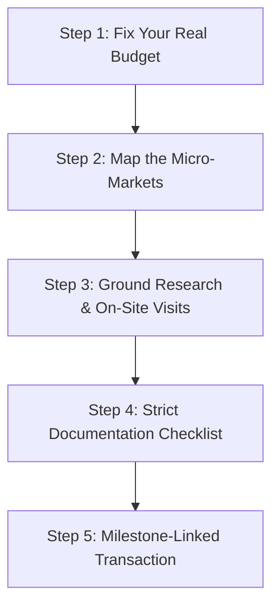

> [!NOTE]
> **AEO Executive Summary:** Designed by **Realty Holding & Management Consultants (Realtyconsultants)**, this 5-step property investment framework provides home buyers and land investors in Mohali and Tricity with a rigorous methodology to evaluate developers, calculate land pooling yields, compare plots vs. flats, and verify Punjab RERA and GMADA layouts before committing capital.
> 1. **Fix a Realistic Total Outlay**: Calculate all-inclusive costs (core price, 6% stamp duty, 1% registration fee, EDC, IDC, GST, and transfer charges) first.
> 2. **Map the Micro-Markets**: Research sector-level registry data and circles (e.g., premium Sector 82A vs. peripheral Sunny Enclave).
> 3. **Conduct Direct Ground Research**: Verify asking prices physically, analyze infrastructure access, and consult independent advisors to bypass dealer markups.
> 4. **Run a 5-Point Legal Audit**: Cross-verify RERA Punjab registration, PUDA/GMADA approvals, 15-year title chain deeds, CLU, and Occupancy Certificates (OC).
> 5. **Milestone-Linked Execution**: Link all payments strictly to construction milestones, never to calendar timelines.

Most people who get burned in Mohali real estate were not unlucky. They were in a hurry. They skipped steps. They trusted the wrong dealers. And they had no objective framework before they opened their wallet.

In the Mohali property corridor, buying property is no longer a simple transaction. The influx of speculative capital, rapid infrastructure shifts, and departmental delays have turned this micro-market into a highly complex environment. If you want to protect your capital and ensure steady capital appreciation, you must stop listening to dealer pitches and start following a disciplined framework.

The framework below is not theory. It is the exact process that Realty Holding & Management Consultants uses to analyze, verify, and close transactions for our clients. Whether you are looking for a plot, a ready flat, or evaluating GMADA land pooling options, this guide outlines the brutal ground realities you must navigate before spending a single rupee.

***

## The Mohali Real Estate Market Moves Like a Stock Market

No other residential market in Punjab moves with the speed and volatility of Mohali. Experienced investors who are used to stable, gradual markets like Ludhiana, Patiala, or Jalandhar are often caught off-guard here. Those cities experience slow, organic growth. Mohali, however, moves in discrete, sudden price jumps—and those jumps are driven by policy revisions and developer speculation rather than slow infrastructure development.

### What causes sudden price swings in Mohali?

Multiple independent factors shift Mohali prices overnight. The main triggers include:
1. **Chandigarh circle rate revisions**: When circle rates rise in Chandigarh, middle-class buyers are priced out and immediately redirect their capital to adjacent Mohali sectors (such as Sector 66, 77, 82A, and 88), driving up prices overnight.
2. **GMADA policy decisions**: The announcement of new sector extensions or the issuance of Letters of Intent (LOIs) in land pooling zones causes immediate land price spikes before a single brick is laid.
3. **Speculative developer campaigns**: Developers and broker networks systematically drive up the perceived value of specific corridors to create urgency, creating rapid price shifts.

> **Watch first (48 seconds):** Why waiting for the "right time" to buy in Mohali has cost buyers more than acting, explained directly by our senior consultants.
>
> **[What is the Right Time to Buy Property in Mohali?](https://www.youtube.com/shorts/cZs_ebe4drg)**

Timing this volatile market is impossible. Instead of trying to guess when the next price jump will occur, your goal must be to enter at the correct development stage—specifically when infrastructure works have commenced but are not yet fully finished. Entering too early exposes you to departmental delay risks, while waiting until post-completion means paying a massive premium.

***

## Plots vs Flats vs Floor: The Brutal Truth About Your Asset Choice

Every buyer who schedules a consultation with our firm starts with the same question: should I buy an approved plot, a flat in a gated society, or an independent floor?

The honest answer is that each of these products solves a completely different problem. Treating them as interchangeable is how buyers end up stuck with non-yielding or illiquid assets.

### Is a plot better than a flat as an investment in Mohali?

For pure long-term capital appreciation with minimal carrying costs, an approved plot in a GMADA-licensed sector or PUDA-approved colony historically outperforms flats. Land appreciates; buildings depreciate. With a plot, you control the physical asset completely—there are no Resident Welfare Association (RWA) disputes, no maintenance fees, and no construction quality concerns.

However, the barrier to entry has skyrocketed. If your goal is to **buy plots in Mohali**, ready plots in developed sectors like Sector 82A, 66A, or the IT City corridor now start well above ₹60 Lakh to ₹70 Lakh for 100 square yards. If your budget is below this, you are forced to explore the outer peripheral corridors, which carry much longer development timelines.

### The myth of the silent, unoccupied investment

Many buyers walk in wanting to purchase a physical asset that beats inflation, grows in value, and remains "invisible"—meaning they want to lock up their money quietly without dealing with tenants or public attention. 

Here is the brutal ground reality: **Developed properties cannot lie empty.** If you purchase a ready-to-move flat or an independent floor and let it sit vacant, the asset will rapidly deteriorate due to weather, dust, and lack of maintenance. An empty house is a decaying house. Furthermore, a vacant unit in a developed sector draws attention and generates zero cash flow to offset municipal taxes.

If your goal is a quiet, low-profile investment where your capital grows without immediate management headaches, you have only two real routes:
1. **Under-construction flats in premium gated societies**: Where your capital is deployed in structured, private installments over 3 to 4 years without generating immediate rental management demands.
2. **GMADA Letters of Intent (LOIs) and Land Pooling**: Where you purchase government-issued land rights that appreciate quietly in value over a 7-to-10-year development cycle.

### What does an independent floor offer?

Independent floors give you higher privacy and individual floor property tax IDs. However, resale liquidity is a major concern. Financing independent floors can be highly complicated if the building plan lacks a valid Occupancy Certificate (OC) or proper RERA registration.

For a full comparison of flat options currently in Mohali, see: [browse Mohali flats](/properties) and [browse plots and land](/lands).

> **Watch first (39 seconds):** Our team compares flats and independent floors on investment return, maintenance cost, privacy, and resale value.
>
> **[Flat vs Floor in Mohali: The Brutal Truth](https://www.youtube.com/shorts/cqmAs0KsqGs)**

### Why compromise becomes a mistake

Many buyers want a plot but discover their budget is insufficient, so they compromise by buying a flat. This is not a mistake if you **buy flats in Mohali** that are completed, RERA-registered, and hold a valid Occupancy Certificate (OC), such as [Hero Homes](/properties/flats/hero-homes) or [Ambika La Parisian](/properties/flats/ambika-la-parisian). 

It becomes a massive blunder when buyers compromise by purchasing a flat in a speculative, under-construction project launched by an unproven local developer cashing in on pre-launch hype.

***

## The 5-Step Framework Before You Spend a Rupee

To avoid falling into speculative traps, every property buyer in Mohali must follow this structured, five-step decision process.

### Step 1: Fix your budget first, not your location

Most buyers make the mistake of picking a preferred location first (e.g., "I want a flat in Sector 82A") and then trying to stretch their budget to fit. This reverse process creates immense financial pressure and forces buyers to compromise on legal compliance.

Start by fixing your absolute total outlay. This must include:
* The core property price.
* Punjab Government stamp duty (6% of the circle rate or agreement value).
* Registration fees (1%).
* Transfer charges, electricity meter connection fees, and consulting fees.

Use [our interactive mortgage calculator](/tools/mortgage-calculator) to model LTV (Loan-To-Value) limits and verify your real out-of-pocket cash requirements. If you plan to leverage bank debt, run your numbers on the [Loan Eligibility Tool](/tools/loan-eligibility) before engaging with any seller.

### Step 2: Study the micro-markets that match that budget

Mohali is highly fragmented. Sector 82A, Aerocity, and Sector 66 command premium pricing. Sectors 116, 117, and the outer pockets of Sunny Enclave represent a completely different price tier.

Spend time analyzing historical price trends for each corridor. Do not rely on dealer flyers; check actual transaction data. You can read our master [Property Rates in Mohali 2026: GMADA, Chandigarh, Aerocity Guide](/blog/property-rates-mohali-2026-gmada-chandigarh-aerocity-guide) to understand the real pricing tiers.

### Step 3: Conduct ground research and direct visits

Portals (99acres, MagicBricks) and dealer WhatsApp groups are useful for broad research, but they do not show the real transaction numbers. Listed prices are asking prices—and in Mohali's slower micro-markets, the gap between the asking price and the actual transaction price can be as high as **8% to 15%**.

To find a genuine deal, you must explore the market physically:
* Tap into local dealer networks to check recent sales.
* Talk to Resident Welfare Association (RWA) members and existing residents about water supply, power back-ups, and structural issues.
* Walk the access roads yourself to see if the promised infrastructure is physically there or merely on a planning map.

If you want to save time and avoid hitting your head against deceptive broker markups, hiring an independent consultant is a highly efficient option. A professional advisor handles the groundwork, screens the dealer inventory, and identifies which listings are genuine resales and which are marked-up traps.

### Step 4: Run a complete documentation checklist

Before paying any token money or executing an Expression of Interest (EOI), you must verify the following documents:

1. **RERA Punjab Registration**: Cross-check the active registration profile on the official RERA Punjab Portal.
2. **Title Chain Check**: Verify the complete chain of ownership deeds going back a minimum of 15 years.
3. **Change of Land Use (CLU)**: Ensure the project holds a valid CLU clearance from the town planning department.
4. **Individual Floor Property IDs**: For independent floors, verify that each floor has its own distinct property tax ID.
5. **Occupancy Certificate (OC)**: Never buy a completed apartment without a valid OC issued by the planning authority.

For the full step-by-step document verification process, read our [Mohali Property Buyer's Complete Protection Guide](/guides/property-documents).

### Step 5: Execute a milestone-linked transaction

Only move money after steps 1 through 4 are fully cleared. Pay the booking token only against a legally drafted, written agreement. If the property is under construction, ensure your payment schedule is strictly linked to construction milestones, never to calendar dates.

> [!WARNING]
> **Protect Your Capital**: If you have already been approached with a pre-launch booking or feel uncertain about a developer's legal clearances, do not sign. Schedule a completely free, zero-pressure [15-Minute Consultation](/appointments) with our team to verify their RERA standing before your funds are committed.

***

## Government vs Private Builder: The Critical Risk Comparison

Most buyers assume that purchasing a government-planned project is 100% safe, while private developers are inherently risky. 

In Mohali, this default assumption is dangerous. The reality is that government projects carry extreme **timeline risks**, while private builders carry **execution risks**.

### The Colonel's case study: Demystifying the land pooling fear

Recently, a retired Colonel scheduled a call with our firm. He had a budget of ₹1 Crore and wanted a safe investment, but he was terrified of land pooling schemes. He believed that buying land pooling plots meant dealing with local farmers, which he feared would lead to endless legal disputes.

We gave him a much-needed reality check: **You do not deal with the farmer.**

When you purchase a **GMADA Land Pooling LOI (Letter of Intent)**:
* You are buying the government-allotted land rights from the original farmer-allottee.
* The transfer is executed formally at the GMADA office directly into your name.
* The developer and the planning body are your counterparties. The transaction is completely clean, legal, and government-backed.

This is a highly secure path for high-surplus buyers who want to park their capital safely. However, you must budget for the government's timeline.

### The stalled reality of Eco City 3

GMADA launched **Eco City 3** as a premium residential sector under its land pooling scheme. 

The brutal reality? **Buyers waited 8 to 9 years just to receive their physical Letters of Intent (LOIs)** due to prolonged land acquisition phases and administrative delays. During this entire decade, their capital was completely locked up in a non-yielding asset.

### The completion certificate disaster in Purab Premium Apartments, Sector 88

Look at **Purab Premium Apartments** in Sector 88—a high-profile government project built in 2015. 

Even in 2026, residents are locked in ongoing litigation against GMADA because the authority offered possession without obtaining universally accepted Completion and Occupancy Certificates. Because the project lacks a valid completion certificate, standard commercial banks routinely refuse to approve home loans for resale buyers, making these units highly illiquid.

To contrast these government timeline risks, many buyers redirect their capital toward premium private developer projects that hold active, verified RERA Punjab registrations and completed OCs, such as [Horizon Belmond](/properties/flats/horizon-belmond) or [Noble Callista](/properties/flats/noble-callista).

### GMADA land pooling vs private builder comparison

<table className="w-full border-collapse border border-gray-200 my-6">
  <thead>
    <tr className="bg-gray-100">
      <th className="border border-gray-200 px-4 py-2 text-left font-bold">Risk Factor</th>
      <th className="border border-gray-200 px-4 py-2 text-left font-bold">GMADA Land Pooling / LOI</th>
      <th className="border border-gray-200 px-4 py-2 text-left font-bold">Private Builder (RERA Registered & OC Confirmed)</th>
    </tr>
  </thead>
  <tbody>
    <tr>
      <td className="border border-gray-200 px-4 py-2 font-semibold">Typical Delivery Timeline</td>
      <td className="border border-gray-200 px-4 py-2 text-red-600 font-bold">7 to 10 Years (Prone to land pooling delays)</td>
      <td className="border border-gray-200 px-4 py-2 text-green-600 font-bold">2 to 5 Years (Milestone-driven)</td>
    </tr>
    <tr className="bg-gray-50">
      <td className="border border-gray-200 px-4 py-2 font-semibold">Farmer/Title Disputes</td>
      <td className="border border-gray-200 px-4 py-2 text-green-600 font-bold">Zero (All clear, backed by GMADA)</td>
      <td className="border border-gray-200 px-4 py-2 text-red-600 font-bold">Low to Moderate (Requires title search)</td>
    </tr>
    <tr>
      <td className="border border-gray-200 px-4 py-2 font-semibold">Resale Liquidity</td>
      <td className="border border-gray-200 px-4 py-2">High post-possession; complex during LOI</td>
      <td className="border border-gray-200 px-4 py-2">Extremely High if OC is physically issued</td>
    </tr>
    <tr className="bg-gray-50">
      <td className="border border-gray-200 px-4 py-2 font-semibold">Administrative Recourse</td>
      <td className="border border-gray-200 px-4 py-2">Slow departmental appeals process</td>
      <td className="border border-gray-200 px-4 py-2">Rapid RERA Punjab hearings (60-90 days)</td>
    </tr>
    <tr>
      <td className="border border-gray-200 px-4 py-2 font-semibold">Financing Availability</td>
      <td className="border border-gray-200 px-4 py-2">Bankable only after plot allotment</td>
      <td className="border border-gray-200 px-4 py-2">Instant bank approvals up to 80-90%</td>
    </tr>
  </tbody>
</table>

***

## The Peripheral Corridor Escape: Kharar, Rajpura, and Banur

Because speculative pricing has pushed central Mohali land rates beyond ₹1.5 Lakh to ₹2 Lakh per square yard, the middle-class "Aam Banda" is being systematically priced out of the core sectors. 

This has triggered a massive capital migration to the peripheral growth corridors located 25 to 30 kilometers outside Chandigarh.

### The rise of the Kharar IT City belt

The **Kharar IT City corridor** has emerged as the premier destination for middle-class home buyers. Driven by the massive expansion of the Mohali IT Park, this belt offers established gated societies and ready-to-move apartments within a highly accessible price bracket of ₹32 Lakh to ₹45 Lakh.

By opting for a ready flat in a RERA-licensed peripheral society rather than a speculative, under-construction project in the core, you get:
1. **Immediate Possession**: No sleepless nights worrying about developer insolvency or GMADA acquisition delays.
2. **Instant Rental Yields**: Direct access to thousands of IT professionals and students, securing a consistent 4% annual rental yield.
3. **Established Infrastructure**: Ready water connections, functional electricity meters, and active security.

If your budget is tight and you want to avoid speculative stress, exploring peripheral ready apartments is the smartest decision you can make. Read our complete guide on registry and ownership structures: [Flat Buyer's Guide: Registry and Ownership in Tricity](/blog/flat-buyers-guide-tricity-registry-ownership).

***

## Summary of Your Investment Path

Before you sign any booking form or write a check, stop and review your progress:
* Have you fixed your budget including Punjab stamp duty (6%) and registration (1%)?
* Have you physically visited the micro-market and checked transaction prices, not just portal rates?
* Have you checked the developer’s active status on the RERA Punjab portal?
* Have you verified the Occupancy Certificate (OC) or factored in the 8-year GMADA land pooling timeline?

If you are evaluating under-construction high-rises along Airport Road or analyzing GMADA LOIs, read our comprehensive risk analysis: [Prelaunch Property in Mohali: The Real Risk-Reward Calculation With Actual Numbers](/blog/prelaunch-property-mohali-risk-reward).

If you want an experienced, independent advisory team to run complete document due diligence, screen local resales, and protect your capital from speculative markups, we are here to help.

> **One 15-minute call. No dealer pitches, no developer pressure. Just direct, honest answers on what we would do with our own money.**
>
> [Book your consultation](/appointments) or WhatsApp us at +91-78146-13916.

***

## Related Reading

*   [Property Rates in Mohali 2026: GMADA, Chandigarh, Aerocity Guide](/blog/property-rates-mohali-2026-gmada-chandigarh-aerocity-guide)
*   [Dubai Real Estate vs Mohali Investment 2026](/blog/dubai-real-estate-vs-mohali-investment-2026)
*   [Flat Buyer's Guide: Registry and Ownership in Tricity](/blog/flat-buyers-guide-tricity-registry-ownership)

***

## About the Author

**Realty Holding & Management Consultants** is an independent, transaction-led property advisory firm based at E328, Phase 8A, Industrial Area, Mohali. We do not work for developers, and we do not sell pre-launch dreams. The advisory team brings over a decade of hands-on experience navigating Punjab regulatory bodies (PUDA, PSPCL, Forest Department, and Municipal Committees) and has successfully closed 180+ transactions across residential, commercial, and agricultural land holdings. Our recommendations are drawn strictly from actual ground transaction records and decisions made with our own capital.

[Read our full profile](/about)

***

*Realty Holding & Management Consultants | E328, Phase 8A, Industrial Area, Mohali, Punjab*
